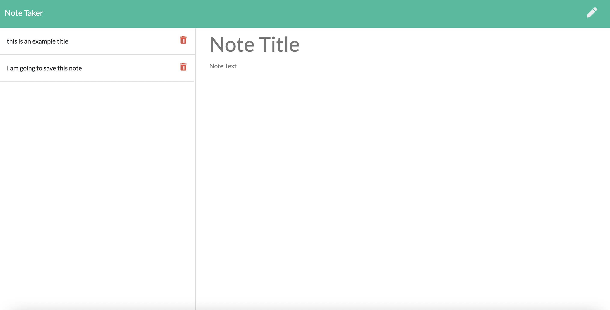

# Notes-Tracker

# Project Description
this project was created with the goal of having an application that uses EXPRESS to save, delete and display notes to the browser.

Link to deployed application: https://note-taker-express-unit.herokuapp.com/
 

This is the homescreen of the application
 

 
on the homepage, the user only has the option to "get started" by clicking the button. after clicking it, the user will be taken to the note taking screen. 
 
the note taking screen looks like this
 

 
then, the user has the options of deleting saved notes or adding a new note by cliking in the respective icons. The icons are found on the top right corner of the screen. Here is an example
 

 
after clicking on the save icon, the note will appear on the left
side of the screen with other saved notes. Here is an example
 

 
This app is hosted by Heroku

# Additional information
for additional information feel free to contact me 
# Contact info
email: dyylancasanova17@gmail.com   GitHub: Dylan-Casanova

